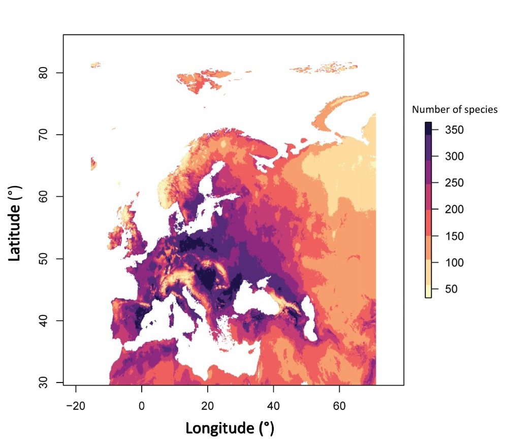

# DanishBirdsGenome
Code used in Danish Birds Genome Project

## Visualization
* GeoRange of Danish Birds Diversity
	* Danish Birds Diversity in Europe

* Visualization for Paper

## Statistics
* Assembly Statistics
* BUSCO Statistics
* Protein Coding Sequence Annotation Statistics
* Repeat Sequence Annotation Statistics